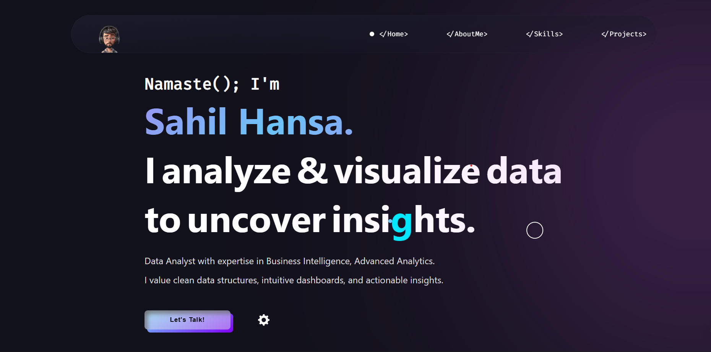

# <a href="https://sahil-hansa.github.io/" target="_blank">My Data Analytics Portfolio</a>
<p align="justify">This website showcases my comprehensive journey in data analytics, featuring end-to-end projects, technical skills, professional experience, and contact information. Built to demonstrate my expertise in Power BI, SQL, Python, and business intelligence.</p>

[](https://github.com/SAHIL-HANSA/SAHIL-HANSA.github.io)
[](https://sahil-hansa.github.io/)
[](https://www.linkedin.com/in/sahil-hansa/)
[](https://github.com/SAHIL-HANSA/SAHIL-HANSA.github.io)
<a href="https://github.com/SAHIL-HANSA/SAHIL-HANSA.github.io/blob/master/LICENSE"></a>




:star: Star me on GitHub — it helps!

# Sections 📚

✔️ Professional Introduction\
✔️ About Me - Data Analytics Journey\
✔️ Resume Download
✔️ Technical Skills & Tools\
✔️ Featured Projects (4 End-to-End Analytics Projects)\
✔️ Contact Information\


## Featured Projects 🚀

### 1. **Revenue & Sales Dashboard** 
- **Tools:** Power BI, DAX, Data Modeling
- **Impact:** Enhanced sales performance tracking and KPI monitoring
- **Repository:** [View Project](https://github.com/SAHIL-HANSA/revenue-sales-dashboard)

### 2. **Customer Segmentation Analysis**
- **Tools:** Advanced SQL, Machine Learning, Python
- **Impact:** Improved customer targeting and retention strategies
- **Repository:** [View Project](https://github.com/SAHIL-HANSA/customer-segmentation-sql)

### 3. **Marketing Campaign Dashboard**
- **Tools:** Power BI, Python Automation, SQL
- **Impact:** Optimized marketing ROI and campaign performance
- **Repository:** [View Project](https://github.com/SAHIL-HANSA/marketing-campaign-dashboard)

### 4. **Employee Attrition Analysis**
- **Tools:** SQL, Python, Statistical Analysis, Excel
- **Impact:** Reduced employee turnover through data-driven retention strategies
- **Repository:** [View Project](https://github.com/SAHIL-HANSA/employee-attrition-analysis)

## Technical Skills Showcase 💻

- **Business Intelligence:** Power BI Dashboard Development, DAX Formulas
- **Database Management:** Advanced SQL Querying, Data Extraction & Analysis
- **Programming:** Python (Pandas, NumPy, Matplotlib, Seaborn)
- **Analytics:** Statistical Analysis, Predictive Modeling, Data Visualization
- **Tools:** Excel Advanced Analytics, ETL Processes, GitHub Project Management

## Installation & Deployment 📦
- Clone the repository and modify the content of <b>index.html</b> according to your requirement.
- ⚠️ Replace placeholder content with your own projects, skills, and professional information.⚠️
- Add or remove project images from `assets/` directory as per your portfolio needs.
- Update skill icons and project screenshots in the respective folders.
- ⚠️<b>NOTE:</b> Make sure to update `analyticsId` & `google search console Id` in `<head>` tag with your own Google Analytics account for tracking.⚠️

## Professional Highlights 🎯

📊 **4 Complete End-to-End Data Analytics Projects**\
🔍 **Advanced SQL & Database Management Expertise**\
📈 **Power BI Dashboard Development & DAX Proficiency**\
🐍 **Python Data Science & Statistical Analysis**\
💼 **Business Intelligence & Strategic Reporting**\
🏆 **Top 5 Team Achievement at IIT Delhi Hackathon**\
📍 **Based in Jammu, J&K, India**

## Repository Structure 📁

```
SAHIL-HANSA.github.io/
├── index.html                 # Main portfolio page
├── assets/
│   ├── images/               # Profile and project images
│   ├── icons/               # Skill and technology icons
│   ├── css/                 # Stylesheets
│   └── js/                  # JavaScript functionality
├── projects/
│   ├── project-details/     # Individual project pages
│   └── screenshots/         # Project dashboard images
├── resume/
│   └── sahil-hansa-resume.pdf
├── LICENSE                  # MIT License
└── README.md               # This file
```

## License 📄
This project is licensed under the MIT License - see the [LICENSE.md](./LICENSE) file for details.

## Tools & Technologies Used 🛠️

### **Development Tools:**
* [**GitHub Pages**](https://pages.github.com/) - To host my data analytics portfolio website
* [**HTML5 & CSS3**](https://developer.mozilla.org/) - Modern web technologies for responsive design
* [**JavaScript**](https://javascript.com/) - Interactive portfolio functionality
* [**Animate on Scroll (AOS)**](https://github.com/michalsnik/aos) - Smooth animations while scrolling
* [**Font Awesome**](https://fontawesome.com/) - Professional icons for skills and social links

### **Analytics & Data Tools Featured:**
* [**Power BI**](https://powerbi.microsoft.com/) - Business intelligence dashboards
* [**Python**](https://python.org/) - Data analysis and visualization
* [**SQL**](https://sql.org/) - Database querying and management
* [**Excel**](https://microsoft.com/excel) - Advanced analytics and reporting

## Contact & Professional Links 📞

- **Email:** [sahilhansa007@gmail.com](mailto:sahilhansa007@gmail.com)
- **LinkedIn:** [linkedin.com/in/sahil-hansa](https://linkedin.com/in/sahil-hansa)
- **GitHub:** [github.com/SAHIL-HANSA](https://github.com/SAHIL-HANSA)
- **Location:** Jammu, J&K, India

## Career Objective 🎯

Passionate data analytics professional seeking to leverage comprehensive skills in Power BI, SQL, Python, and statistical analysis to drive business intelligence and data-driven decision making. Proven track record through 4 end-to-end analytics projects spanning sales, marketing, customer insights, and HR analytics.

**Ready to contribute to data-driven organizations and transform complex datasets into actionable business insights.**

---

⭐ **If you find my portfolio and projects helpful, please consider starring this repository!** ⭐

**Feedback and collaboration opportunities are always welcome!**

📧 **Contact me at sahilhansa007@gmail.com for project discussions, job opportunities, or data analytics consultations.**
